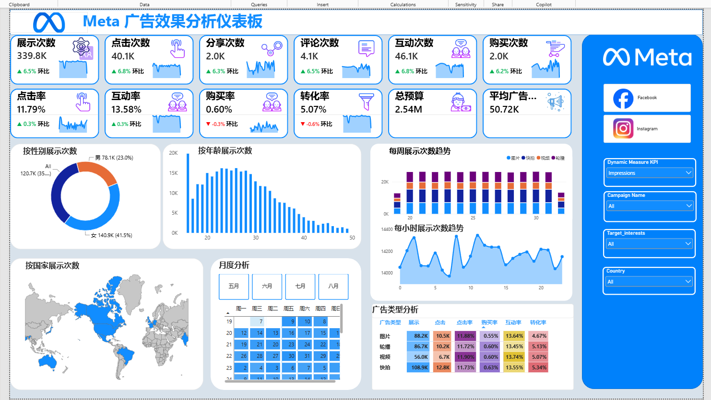
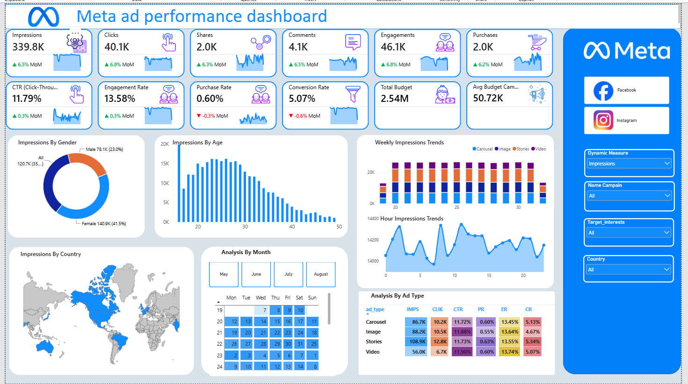

## 📊 Meta Ad Performance Dashboard

This Power BI dashboard provides an interactive analysis of Meta advertising performance, helping users monitor key advertising KPIs and identify performance trends across different dimensions.

The dashboard analyzes metrics such as **Impressions, Clicks, Engagements, Shares, Purchases, CTR, Conversion Rate, and Budget**, with breakdowns by **Ad Type, Campaign, Age, Gender, Country, and Target Interests**.

Key features include:

* 📈 KPI monitoring with **MoM (Month-over-Month) analysis**
* 📊 Dynamic KPI selection for flexible performance analysis
* 👥 Audience analysis by **Age and Gender**
* 🌍 Geographic performance analysis by **Country**
* 📢 Ad performance comparison by **Ad Type and Campaign**
* 🎯 Target Interest performance analysis
* ⏱️ Daily, weekly, monthly, and hourly performance trends

The dashboard is designed to support data-driven decisions by making advertising performance easier to monitor, compare, and identify areas for optimization.

**Tools:** Power BI · DAX · Power Query
## 📊 Dashboard Preview

### Chinese Version 

### English Version 

## 💡 Key Skills Demonstrated

* **Data Analysis**: Analyze advertising performance across multiple dimensions to identify key trends and performance differences.
* **Data Visualization**: Build interactive dashboards and visual reports using Power BI.
* **DAX & Data Modeling**: Create dynamic measures, MoM metrics, and business-oriented analytical measures.
* **Dynamic Analysis**: Use dynamic measure selectors to switch between different performance metrics.
* **Advertising Performance Analysis**: Evaluate performance across different ad types, campaigns, and target interests.
* **Audience Analysis**: Analyze user behavior by age, gender, and country.
* **Trend Analysis**: Analyze advertising performance across hourly, daily, weekly, and monthly time dimensions.
* **Business Insights**: Translate advertising data into actionable insights to support campaign performance evaluation and optimization.
